# Lab 1 — HTTP File Server with TCP Sockets (Docker + Python)

**Course:** Network Programming  
**Student:** Crudu Alexandra (FAF-233)

---

## Abstract

This lab implements a HTTP/1.1 file server using raw TCP sockets in Python. The server serves static files (HTML, PNG, PDF) from a directory and generates directory listings. A companion HTTP client is provided to fetch pages and download files. Everything runs via Docker Compose for reproducibility.

---

## Learning Objectives

- Apply Application Layer concepts: HTTP over TCP, request/response format, status codes, MIME types, statelessness
- Practice socket programming: accept connections, parse requests, build responses
- Package and run network software using Docker Compose
- Validate functionality through browser and CLI tests, including LAN access

---

## Theory Background

**HTTP over TCP via sockets:** Applications use sockets as the interface to TCP. TCP ensures reliable, in-order delivery while the app formats HTTP messages.

**Stateless protocol:** Each request is independent. The server closes after responding (non-persistent connections).

**Message format:** Request line + headers + optional body. Response has status line + headers + optional body.

**Status codes:** 200 OK, 404 Not Found, 405 Method Not Allowed.

**MIME types:** `.html` → `text/html`, `.png` → `image/png`, `.pdf` → `application/pdf`

**Port:** Using 8000 to avoid conflicts with default HTTP port 80.

---

## How to Run

```bash
# Build and start server
docker compose build
```
Builds the project’s Docker images from the Dockerfile(s) defined in docker-compose.yml, packaging all dependencies.
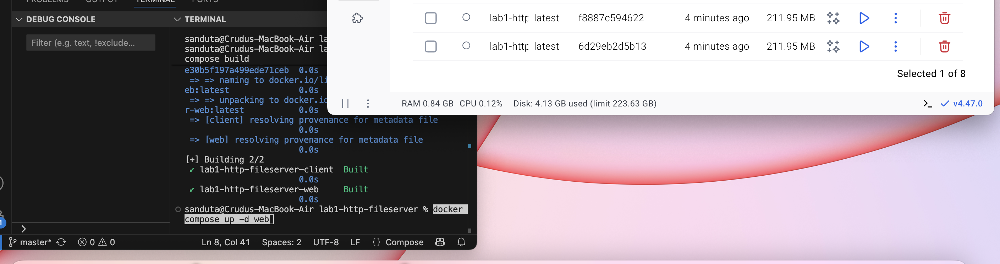


```bash
# Build and start server
docker compose up -d web
```
Starts the web service container in the background (detached), publishes its ports, and runs the HTTP server so others on the LAN can reach it.
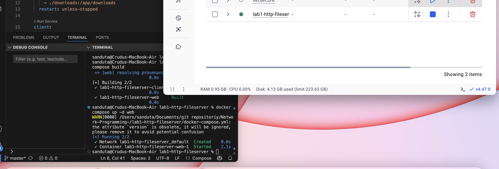


```bash
python server.py /app/site --host 0.0.0.0 --port 8000
```
Runtime command inside container: python server.py /app/site --host 0.0.0.0 --port 8000 (where /app/site is the served root):

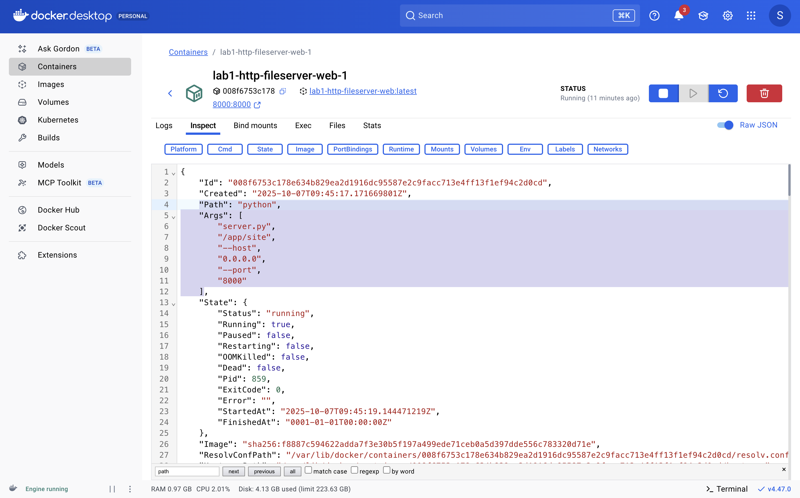


```bash
# Access via browser
http://localhost:8000/
```
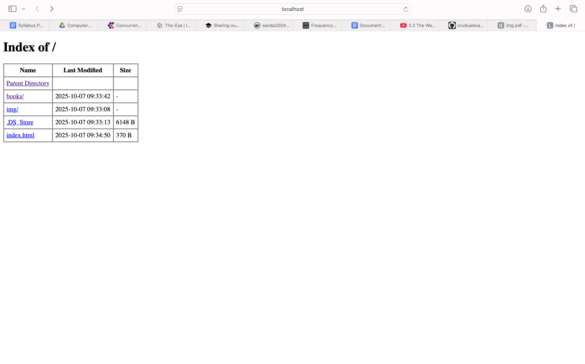


### Inexistent file (404):


### HTML file with image:


### PDF file:

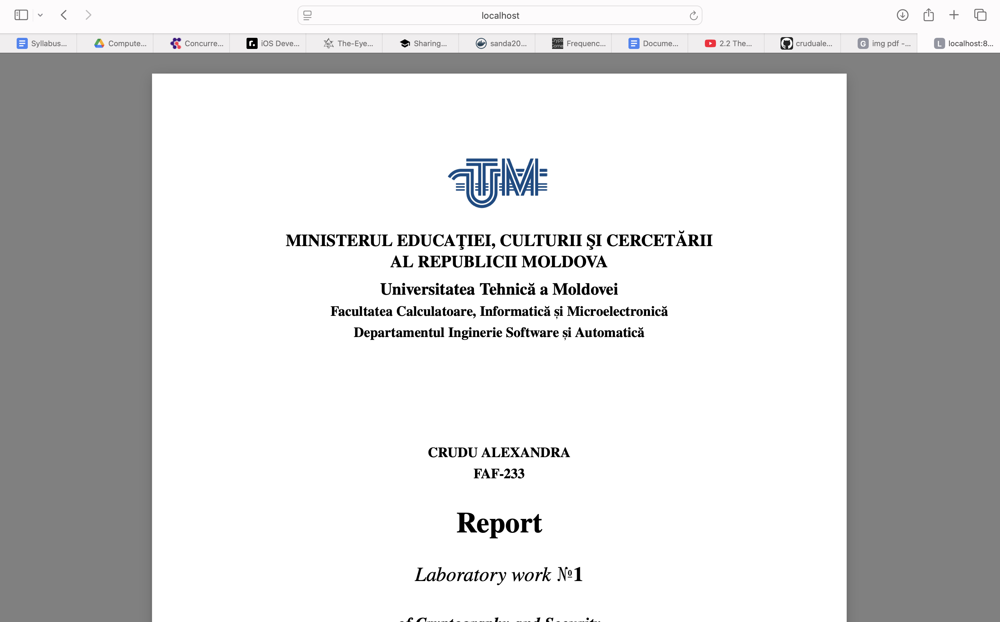

### PNG file:


## Client


```bash
# Run client examples
docker compose run --rm client web 8000 /
docker compose run --rm client web 8000 books/
```

Runs the client container to request GET / from the web service on port 8000 and prints the HTML directory listing of the server’s root:
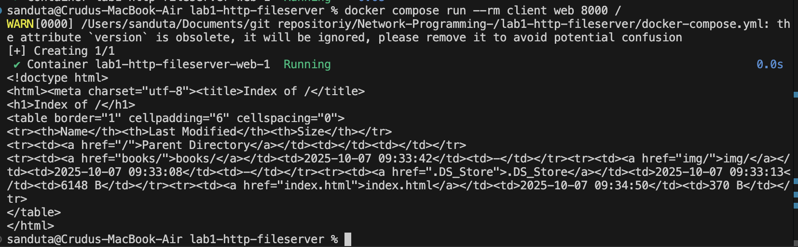

Runs the client container to request GET /books/ from the web service on port 8000 and prints the HTML directory listing of the books subdirectory:


```bash
# Downloads
docker compose run --rm client web 8000 img/sample.png
docker compose run --rm client web 8000 books/sample.pdf
```
Downloads folder initially: 

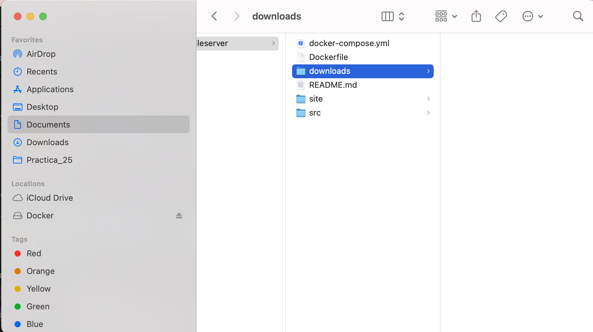

Runs the client to fetch GET /img/sample.png from the web service on port 8000 and saves the PNG to downloads/sample.png:

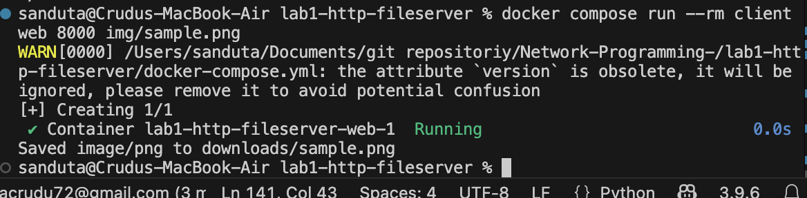
 Runs the client to fetch GET /books/sample.pdf from the web service on port 8000 and saves the PDF to downloads/sample.pdf:
 
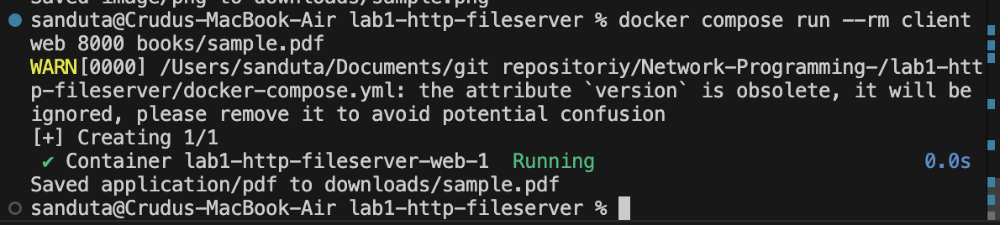
Downloads folder after:

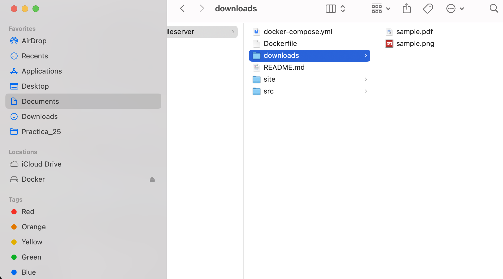


```bash
# LAN access (get IP first)
ipconfig getifaddr en0  # macOS
http://<YOUR_IP>:8000/
```

Results when reaching in the same LAN from another device:

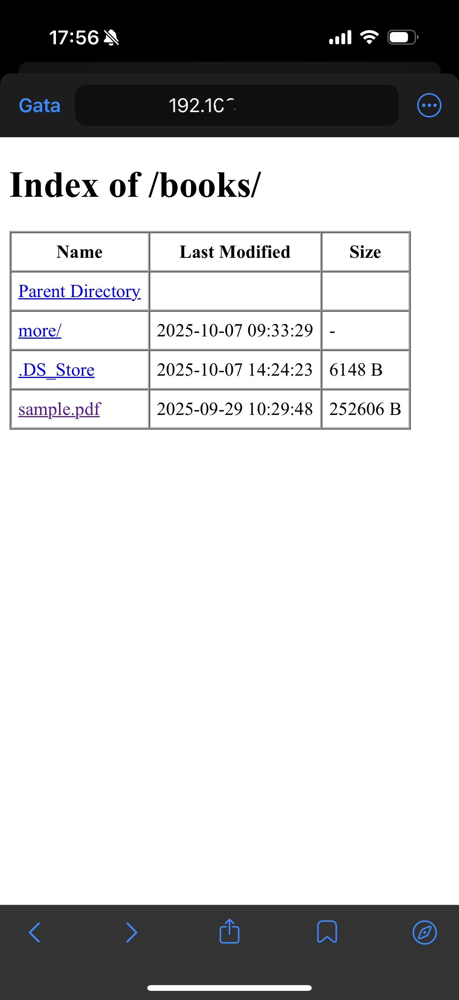

Downloading for example the pdf:
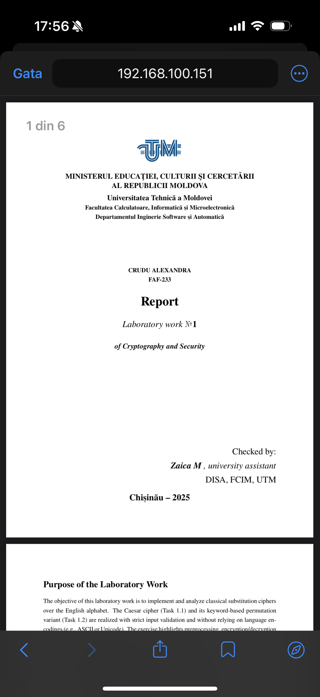

```bash
# Stop
docker compose down
```

---

## Implementation

### Server: Accept Connections
```python
import socket
s = socket.socket(socket.AF_INET, socket.SOCK_STREAM)
s.setsockopt(socket.SOL_SOCKET, socket.SO_REUSEADDR, 1)
s.bind(("0.0.0.0", 8000))
s.listen(1)
while True:
    conn, addr = s.accept()
    with conn:
        handle(conn)  # Process one request and close
```
Creates a TCP server that listens on port 8000 and handles one client at a time (stateless, non-persistent).

---

### Parse HTTP Request
```python
buf = b""
while b"\r\n\r\n" not in buf:
    buf += conn.recv(4096) or b""
line = buf.decode("iso-8859-1").split("\r\n", 1)[0]
method, path, version = line.split()  # "GET /books/ HTTP/1.1"
```
Reads from socket until complete headers received, then extracts method and path from request line.

---

### Build HTTP Response
```python
def respond(code, reason, headers=None, body=b""):
    h = headers or {}
    h.setdefault("Connection", "close")
    if body:
        h.setdefault("Content-Length", str(len(body)))
    start = f"HTTP/1.1 {code} {reason}\r\n"
    head = "".join(f"{k}: {v}\r\n" for k, v in h.items())
    return (start + head + "\r\n").encode("iso-8859-1") + body
```
Constructs a valid HTTP response with status line, headers, blank line, and optional body.

---

### Route Requests
```python
MIME = {".html": "text/html; charset=utf-8", ".png": "image/png", ".pdf": "application/pdf"}

p = urllib.parse.unquote(urllib.parse.urlparse(path).path).lstrip("/")
fs = os.path.normpath(os.path.join("/app/site", p))

if os.path.isdir(fs):
    # Generate directory listing
    items = "\n".join(f'<a href="{n}/">{n}</a>' for n in sorted(os.listdir(fs)))
    body = f'<!doctype html><h1>Index of {path}</h1><pre>{items}</pre>'.encode()
    conn.sendall(respond(200, "OK", {"Content-Type": "text/html"}, body))
else:
    # Serve file or 404
    ext = os.path.splitext(fs)[1].lower()
    if os.path.exists(fs) and ext in MIME:
        conn.sendall(respond(200, "OK", {"Content-Type": MIME[ext]}, open(fs, "rb").read()))
    else:
        conn.sendall(respond(404, "Not Found", {"Content-Type": "text/html"}, b"<h1>404</h1>"))
```
Normalizes paths (prevents directory traversal), generates HTML directory listings, or serves files with correct MIME types.

---

### Client
```python
req = b"GET /books/sample.pdf HTTP/1.1\r\nHost: web\r\nConnection: close\r\n\r\n"
with socket.create_connection(("web", 8000)) as s:
    s.sendall(req)
    raw = b"".join(iter(lambda: s.recv(4096), b""))
    head, _, body = raw.partition(b"\r\n\r\n")
    # Save binary files or print HTML
    if b"pdf" in head or b"image" in head:
        open("downloads/file.pdf", "wb").write(body)
    else:
        print(body.decode())
```
Sends HTTP GET request, reads response, and saves files or prints HTML based on Content-Type.

---

## Docker Configuration

**Dockerfile:**
```dockerfile
FROM python:3.11-slim
WORKDIR /app
COPY src/ /app/
EXPOSE 8000
CMD ["python", "server.py", "/app/site", "--host", "0.0.0.0", "--port", "8000"]
```

**docker-compose.yml:**
```yaml
version: "3.9"
services:
  web:
    build: .
    ports: ["8000:8000"]
    volumes:
      - ./site:/app/site:ro
  client:
    build: .
    entrypoint: ["python", "client.py"]
    volumes:
      - ./downloads:/app/downloads
```


---

## Key Concepts

**Sockets ↔ Transport:** We write HTTP bytes to TCP sockets; TCP ensures reliability and order.

**Stateless HTTP:** One request per connection (`Connection: close`) keeps logic simple.

**Message Format:** Status line + headers (Content-Type, Content-Length) + body ensures browser compatibility.

**Security:** Path normalization prevents directory traversal; only whitelisted MIME types served.

**Auto-index:** Generated directory listings prove nested content is reachable via hyperlinks.

---

## Conclusion

This lab demonstrates HTTP protocol implementation using raw TCP sockets. By building both server and client from scratch, we understand how application-layer protocols operate over transport-layer services. The containerized approach ensures portability and reproducibility while showcasing core networking concepts: socket programming, protocol formatting, and stateless communication.


## Bibliography

Kurose, J. F., & Ross, K. W. (2021). *Computer Networking: A Top-Down Approach* (8th ed.). Pearson.

*Computer Networks - Chapter 2: Application Layer* [Video]. (n.d.). YouTube. https://youtu.be/74sEFYBBRAY?si=MttMCG5A8FjK6cyf
